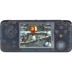

# RetroGame (RS97)

  
|Component|Description                      |
|---------|---------------------------------|
|CPU      |Ingenic JZ4760                   |
|RAM      |128MB                            |
|Storage  |2GB                              |
|Screen   |3.0" 480x320                     |
|Slot     |MicroSD                          |
|Gamepad  |DPad, 4 Buttons, Menu, Mode, L, R|
|USB      |Client                           |
|Battery  |3.7V 700mA                       |
|Dimension|183mm x 106mm x 20mm             |
|Weight   |300g                             |

### https://steward-fu.github.io/website/index.htm
